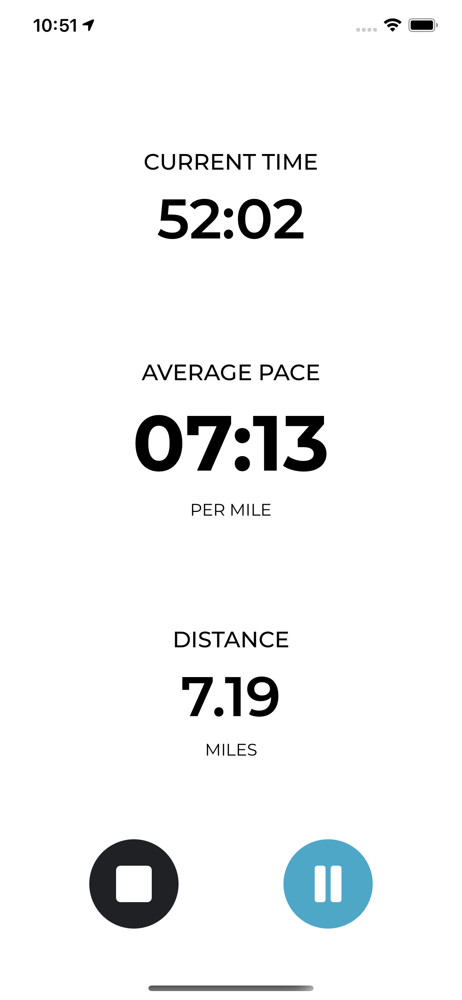

# Dreadmill

A running app that tracks distance and pace during runs and maintains a history of each session, through a performance log.

### Technologies:

* UIKit
* MapKit
* Realm

### Features:

* Polyline display of last run in the home screen.
* Tracks details about users' running sessions.
* Saves a log for each run performed by users.

### Screenshots:

  
